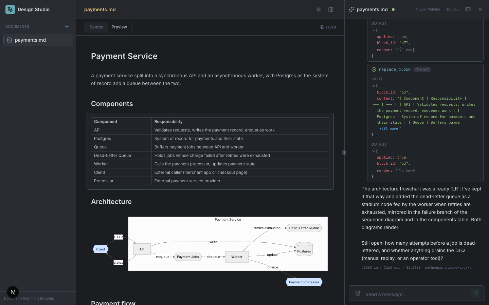

# Design Studio

Design Studio is a small web application for writing software design
documents: Markdown with [Mermaid](https://mermaid.js.org) diagrams,
rendered live, and an assistant sitting beside them. You describe a
system, the assistant draws the diagram, you ask for changes and it edits
the document in place. When Mermaid rejects a diagram it wrote, it reads
the parse error and fixes it.

It exists to demonstrate
[assistant-runtime](https://pypi.org/project/assistant-runtime/), an
assistant backend that an application puts behind its own interface. The
runtime owns the conversation, calls the model and streams the result.
The application describes what is on screen and performs the actions the
model asks for. Design Studio is a complete, deliberately small example
of the application half of that arrangement: one screen, no accounts, no
database, no server of its own, about 6,000 lines of TypeScript.



## What it demonstrates

Every runtime capability here is used because the task needs it, not to
tick a box.

- **Host context.** Every message carries what is on screen: the open
  document, its blocks with a one-line summary each, which block is
  selected, and whether every diagram rendered.
- **Host actions.** The assistant cannot touch your files. It calls six
  actions the app declares (`create_document`, `open_document`,
  `replace_block`, `insert_block`, `delete_block`, `rename_document`); the
  app performs them and hands back the result, including the Mermaid
  render outcome. A parse error is a successful action with a failed
  render, which is what lets the assistant repair its own diagram.
- **Streaming, steering and cancellation.** Thinking, text and tool calls
  arrive as they happen. A message sent while the assistant is working
  becomes a mid-turn nudge; stopping a turn keeps the partial answer.
- **Branching.** "Try a variant" sends a different message from an earlier
  point in the conversation; a switcher moves between the branches, which
  the runtime keeps as a tree.
- **Attachments.** Drop an image into the chat and the assistant sees it.
  While a document is open, a screenshot of the rendered preview travels
  with every message, and the assistant looks at it only when it decides
  to.
- **Prompt artifacts.** The assistant's own instructions are visible in
  the panel. One of them, the diagram style guide, is one the assistant
  may propose changes to: say "always put a legend in architecture
  diagrams" and it proposes a new version, which waits for your approval.
- **Cost.** Tokens and cost per message, and a running total for the
  session.
- **Recovery.** Reload the page while the assistant is waiting for the app
  to perform an action and the reloaded page performs it and continues.

## Running it

You need [bun](https://bun.sh), a way to install a Python command line tool
([uv](https://docs.astral.sh/uv/) or pip), and an API key for one of the
providers the runtime supports (Anthropic, OpenAI, Google or OpenRouter).

The runtime is a separate process. You install it once and run it beside
the studio.

**Terminal 1, the runtime:**

```bash
uv tool install assistant-runtime      # or: pip install assistant-runtime

# a provider key; the runtime also reads a .env in the directory you run it in
export ANTHROPIC_API_KEY=sk-ant-...

# the assistant profile that makes the runtime a design partner. The path must
# be absolute, and `echo "$PWD/profiles/design-studio.toml"` in this repository
# prints it for you.
export ASSISTANT__PROFILE=/absolute/path/to/design-studio/profiles/design-studio.toml

assistant-runtime serve --port 7100
```

**Terminal 2, the studio:**

```bash
git clone https://github.com/eandualem/design-studio
cd design-studio
bun install
bun run dev
```

Open <http://localhost:7130> and ask for something: *"Design a payment
service with an API, a worker, Postgres and a queue."*

`assistant-runtime docs` lists the runtime's own documentation and
`assistant-runtime docs host-contract` prints a page; it ships with the
package, so nothing here needs a checkout.

Two things worth knowing on a first run. The studio talks to the runtime
at `http://127.0.0.1:7100`; set `NEXT_PUBLIC_RUNTIME_URL` to point
somewhere else. Documents live in your browser's IndexedDB, but
conversations live in the runtime's memory, so restarting it clears the
chat and leaves the documents. Give the runtime a Postgres database
(`assistant-runtime migrate` once, first) and the conversations survive
too.

## Using it

The centre pane has a **Source** tab you can type in and a **Preview** tab
that renders it. A document is split into blocks, headings and paragraphs
as text and fenced `mermaid` code blocks as diagrams; the assistant edits
one block at a time. Click a block in the preview to select it, and the
assistant is told what you selected.

The right pane is the assistant. Each document carries its own
conversation, so switching documents switches the chat. The book icon in
its header opens the assistant's artifacts, where a proposed style-guide
change waits for approval.

## The demo

With both processes running and Google Chrome installed, `bun run demo`
drives the whole feature set through the real app and writes screenshots
and a table of timings and costs to `.tmp/demo/`:

1. Ask for a payment service. The assistant creates the document and draws
   the first diagram.
2. Ask for it left to right with a dead-letter queue. It edits the blocks.
3. Ask for something that makes Mermaid fail. It reads the parse error and
   repairs the diagram.
4. Try a variant of step 2 as a sequence diagram, then switch between the
   two branches.
5. Nudge the assistant mid-answer, then cancel it; the partial answer
   stays.
6. Drop a whiteboard photo and ask for it as a diagram.
7. Ask whether the queue is readable; the assistant looks at the preview.
8. Reload the page while an edit is pending; the reloaded page finishes it.
9. State a lasting preference; approve the style-guide change it proposes.
10. Read the cost per message and for the session.

A full run takes about ten minutes and costs roughly two dollars with
`anthropic:claude-opus-5`. `DEMO_STEPS=1,2 bun run demo` runs a subset, and
step 6 needs a picture of your own: `DEMO_PHOTO=/path/to/sketch.png`.

## How it is built

Next.js and XState, in four layers that do not reach past each other:
components render props, hooks expose `{ state, data, actions }`, machines
hold every transition and side effect, and `lib/` is pure functions.

| Directory | What lives there |
|---|---|
| `machines/` | `appMachine` (root), `filesMachine`, `documentMachine`, `assistantMachine` |
| `hooks/` | the bridge between machines and components |
| `components/` | `assistant/`, `document/`, `layout/`, `ui/` |
| `lib/` | block parsing and edits, host actions, stream folding, host context, the runtime client, IndexedDB, Mermaid |
| `types/` | Zod schemas for every wire shape |
| `profiles/` | the assistant profile and its artifact texts |

The interesting file is `machines/assistantMachine.ts`: the socket, the
stream folded into messages, and the pause on a pending host action that
the app answers with a continuation.

```bash
bun run lint && bun run test && bun run build
```

Contributor notes are in [AGENTS.md](AGENTS.md).

## License

MIT, see [LICENSE](LICENSE). The bundled Inter and JetBrains Mono fonts
are under the SIL Open Font License; see
[public/fonts/OFL.txt](public/fonts/OFL.txt).
